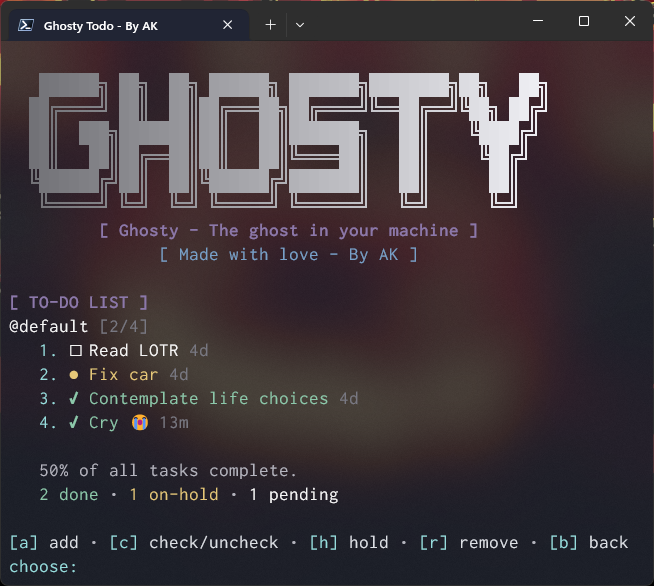
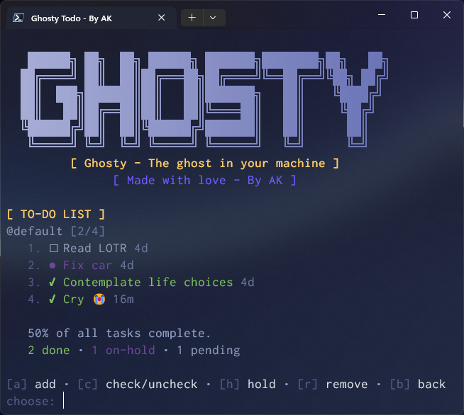

# 👻 Ghosty Todo

A minimalist, beautiful todo list manager that lives in your terminal.

<p float="left">
  
  
  
  
</p>

## Requirements

- **Python 3.6 or higher** - [Download Python](https://www.python.org/downloads/)
- No external dependencies! Pure Python.
- MS Store Powershell is also recommended.

Check if Python is installed:
```bash
python --version
# or
python3 --version
```

## Installation

### Option 1: Install with pip + Portable Mode (Recommended)

Best of both worlds - run `ghosty` from anywhere while keeping your data with the code!

```bash
# 1. Create program directory e.g 'ghosty-todo'
cd ghosty-todo

# 2. Clone the repository
git clone https://github.com/ak47man08/ghosty-todo.git

# 3. Create portable.txt file (enables portable mode)
touch portable.txt          # Linux/Mac
type nul > portable.txt     # Windows CMD
New-Item portable.txt       # Windows PowerShell
Create .txt file manually   # Universal

# 3. Install in editable mode
pip install -e .
```

Now you can:
- ✅ Run `ghosty` from anywhere in your terminal
- ✅ All data stays in `.ghosty_data/` next to `ghosty.py`
- ✅ Easy to backup/sync the entire folder
- ✅ Perfect for cloud folders (Dropbox, Google Drive, etc.)
- ✅ Edit the code and see changes immediately

**Without portable mode?** Just skip step 3 and data will be stored in `~/.ghosty_todo/`

### Option 2: Install with pip (Standard)

```bash
# 1. Create program directory e.g 'ghosty-todo'
cd ghosty-todo

# 2. Clone the repository
git clone https://github.com/ak47man08/ghosty-todo.git

# 3. Install normally
pip install .
```

After installation, use the `ghosty` command from anywhere. Data will be stored in `~/.ghosty_todo/`

### Option 3: Add to PATH manually (Windows)

1. Place `ghosty.py` in a permanent location (e.g., `C:\Tools\ghosty\`)
2. Create `ghosty.bat` in the same folder:

```batch
@echo off
python "%~dp0ghosty.py" %*
```

3. Add that folder to your PATH:
   - Search "Environment Variables" in Windows
   - Edit "Path" under System Variables
   - Add the folder path (e.g., `C:\Tools\ghosty\`)
   - Restart your terminal

**For portable mode:** Create `portable.txt` in the same folder!

### Option 4: Run directly (No installation)

```bash
python ghosty.py

# For best experience, choose options 1-3.
```

Data will be stored in `~/.ghosty_todo/` by default.

## Usage

### Interactive Mode
```bash
ghosty
```

Launch the beautiful interactive menu to manage your todos, focuses, and settings.

### CLI Commands
```bash
# List all todos
ghosty list
ghosty ls

# Add a todo
ghosty add "Finish the project"
ghosty a "Buy groceries"

# Check/uncheck todos (supports ranges)
ghosty check 1
ghosty c 1 3-5 7        # Check todos 1, 3, 4, 5, and 7

# Toggle hold status (supports ranges)
ghosty hold 2
ghosty h 1-3 5          # Hold todos 1, 2, 3, and 5

# Remove todos (supports ranges)
ghosty remove 1
ghosty r 2-4 6          # Remove todos 2, 3, 4, and 6
```

**Number Formats:**
- Single: `1`
- Multiple: `1 3 5`
- Ranges: `1-5` or `3-5 7 9-11`

## Features

- ✨ Beautiful, minimalist interface with gradient banners
- 📋 Multiple focuses (workspaces) - each with separate todos
- ⚡ Fast CLI commands with batch operations and range support
- 📊 Automatic progress tracking with stats
- 🎨 Multiple themes (Ghosty Classic, Dracula, Tokyo Dark)
- 💾 Persistent storage with portable mode option
- ⚙️ Highly customizable settings
- ⏰ Time tracking (shows how long ago todos were created)
- 🎯 Three todo states: pending, done, on-hold

## Settings

Access settings through the interactive menu (`ghosty` > Settings):

### Themes
- **Ghosty Classic** - Soft purples and greens
- **Dracula** - Popular dark theme
- **Tokyo Dark** - Modern dark aesthetic

Switch themes instantly and see the changes in real-time!

### Appearance
- **Alternate Banner** - Use ASCII-safe banner for better compatibility
- **Hide Banner in Menus** - Minimalist mode for distraction-free workflow

### Preferences
- **Reprint list after CLI commands** - Shows updated list after every CLI operation
- **Show success responses** - Toggle confirmation messages on/off

## Backups, Imports & Exports

### Your Data Location

**Portable Mode:** `.ghosty_data/` folder next to `ghosty.py`  
**Standard Mode:** `~/.ghosty_todo/` in your home directory

Both contain:
- `todos.json` - Your todo items
- `config.json` - Your settings

### Automatic Backups

Ghosty automatically creates timestamped backups every time you make changes! 

Backups are stored in:
- **Portable Mode:** `.ghosty_data/backups/`
- **Standard Mode:** `~/.ghosty_todo/backups/`

Ghosty keeps the last 10 backups of each file and automatically removes older ones to save space.

### Manual Backups

Simply copy the data folder:

```bash
# Portable mode
cp -r .ghosty_data/ .ghosty_data_backup/

# Standard mode
cp -r ~/.ghosty_todo/ ~/ghosty_backup/

# Or create a zip
zip -r ghosty_backup.zip .ghosty_data/
```

### Restore or Transfer Data

Copy your backed-up folder to the new location and restart Ghosty.

### Sync Across Computers

**Easiest method:** Use portable mode in a cloud folder (Dropbox, Google Drive, etc.)

```bash
# Install Ghosty in your cloud folder with portable mode
cd ~/Dropbox/ghosty-todo/
touch portable.txt
pip install -e .
```

Now your todos automatically sync across all computers! ✨

**💡 Tip:** Back up your data regularly, especially before major changes.

## Storage

### Default Mode
Data is stored in `~/.ghosty_todo/`:
- `todos.json` - Your todo items
- `config.json` - Your settings and preferences

### Portable Mode
When `portable.txt` exists next to `ghosty.py`, data is stored in `.ghosty_data/` in the same folder:
- `.ghosty_data/todos.json` - Your todo items
- `.ghosty_data/config.json` - Your settings and preferences

### Switching to Portable Mode (After Standard Install)

If you already installed with `pip install .` (standard mode) and want to switch to portable mode:

```bash
# 1. Find where ghosty.py is installed
pip show ghosty-todo
# Look for "Location:" in the output

# 2. Navigate to that directory
cd /path/to/site-packages  # Use the path from step 1

# 3. Find ghosty.py (it might be in the directory or a subdirectory)
# Common locations:
# - Linux/Mac: ~/.local/lib/python3.x/site-packages/
# - Windows: C:\Python3x\Lib\site-packages\

# 4. Create portable.txt in the same directory as ghosty.py
touch portable.txt          # Linux/Mac
type nul > portable.txt     # Windows CMD

# 5. Copy your existing data (optional)
cp -r ~/.ghosty_todo/ ./.ghosty_data/     # Linux/Mac
xcopy %USERPROFILE%\.ghosty_todo .ghosty_data\ /E /I    # Windows
```

**Easier method:** Uninstall and reinstall with portable mode:
```bash
pip uninstall ghosty-todo
cd /path/to/ghosty/source
touch portable.txt
pip install -e .

# Copy your old data
cp -r ~/.ghosty_todo/ ./.ghosty_data/     # Linux/Mac
```

**Note:** With `pip install -e .` (editable install), switching is easier because you know exactly where `ghosty.py` is - it's in your source folder!

## Customization

### Adding Custom Themes

Open `ghosty.py` and find the `THEMES` dictionary (around line 18). Add your theme:

```python
THEMES = {
    "Your Theme Name": {
        "name": "Your Theme Name",
        "colors": {
            "light_grey": (180, 180, 190),
            "dark_grey": (120, 120, 130),
            "white": (245, 245, 245),
            "ghost_purple": (140, 120, 170),
            "haunted_green": (140, 200, 170),
            "shadow_blue": (120, 160, 200),
            "yellow": (230, 200, 120),
            "red": (220, 80, 80),
            "cyan_faint": (150, 220, 220),
            "banner_start": (110, 110, 115),
            "banner_end": (240, 240, 245)
        }
    }
}
```

**Color Usage Guide:**
- `light_grey` - Secondary text, decorative elements
- `dark_grey` - Muted info (stats, time stamps)
- `white` - Primary text, todo items
- `ghost_purple` - Headers, titles, branding
- `haunted_green` - Success messages, completed items
- `shadow_blue` - Accents, section dividers
- `yellow` - Warnings, on-hold items
- `red` - Errors, removed items
- `cyan_faint` - Menu options, prompts
- `banner_start` - Gradient start color for banner
- `banner_end` - Gradient end color for banner

RGB values range from 0-255. Use a color picker to find your perfect colors!

### Custom Banner

Want your own ASCII art banner?

1. Open `ghosty.py`
2. Find `ALTERNATE_BANNER` (around line 170)
3. Replace with your ASCII art:

```python
ALTERNATE_BANNER = r"""
  ╔═╗╦ ╦╔═╗╔═╗╔╦╗╦ ╦
  ║ ╦╠═╣║ ║╚═╗ ║ ╚╦╝
  ╚═╝╩ ╩╚═╝╚═╝ ╩  ╩ 
"""
```

4. Enable it in Settings > Appearance > Alternate Banner

### Custom Aliases (Linux/Mac)

Add to your `~/.bashrc` or `~/.zshrc`:

```bash
alias g='ghosty'
alias gl='ghosty list'
alias ga='ghosty add'
alias gc='ghosty check'
alias gh='ghosty hold'
alias gr='ghosty remove'
```

## Tips & Tricks

- **Use focuses** to separate work, personal, and project todos
- **Enable "Reprint after command"** for visual feedback in CLI mode
- **Try different themes** to match your terminal setup
- **Batch operations save time**: `ghosty c 1-10` checks all at once
- **Portable mode** is perfect for syncing todos across computers via Dropbox/Google Drive
- **Use ranges** for quick bulk operations: `ghosty r 1-5 10-15`
- **On-hold status** is great for todos waiting on someone else
- **Time tracking** helps you see what's been pending too long

## Troubleshooting

**Colors not showing?**
- Enable "Alternate Banner" in settings for better compatibility
- Ensure your terminal supports true color (most modern terminals do)

**Command not found after pip install?**
- Make sure Python's scripts directory is in your PATH
- Try `python -m ghosty` instead

**Want to reset everything?**
- Delete `~/.ghosty_todo/` (or `.ghosty_data/` in portable mode)
- Ghosty will recreate default settings on next run

## Requirements

- Python 3.6 or higher
- No external dependencies! Pure Python.

## License

MIT License - Feel free to modify and share!

---

Made with love by AK 👻

*Stay spooky and productive!*


